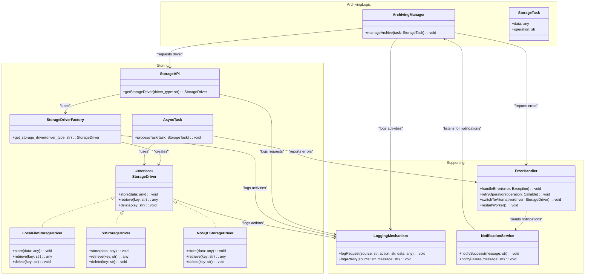

# Storage Drivers

Storage drivers are responsible for safely transferring a finished archive to a specific storage location.

!!! warning "TODO"
    This section is still work in progress (WIP) and might contain incomplete, incorrect, or outdated information.

## Tasks and Responsibilities

!!! abstract "Writing Data to Storage"
    Provides an interface to write archives to storage

    - Data must be stored in a way that overriding existing data is not possible, even if archive file names are
      identical

!!! abstract "Reading Data from Storage"
    Provides an interface to read archives from storage
    
    - If data retrieval is not possible, the data can not be retrieved via Moodle
    - If data retrieval is not possible, GDPR compliance (automatic deletion, personal data retrieval) is not possible

!!! abstract "Authentication"
    Store credentials for authentication against the storage system, if applicable

    - Credentials must only be visible to the system administrators

!!! abstract "Connection Check"
    Provides a way to check the status of the storage system connection (e.g., connection test, test write, test read)

!!! abstract "Storage Space Monitoring"
    Provides a way to monitor the available storage space, if reported by the respective storage system / interface

!!! abstract "Configurability"
    Allowing independent configuration of the different available storage drivers (e.g., storage path, storage system
    credentials, ...)

## Concept Overview

### Implemented Concepts

1. **Encapsulation of Storage Drivers through an API**  
   The StorageDriver implementations are abstracted behind an API that serves as a central entry point. This provides a
   clear separation between the logic for selecting drivers and their actual usage, enhancing maintainability and
   scalability.
2. **Asynchronous Communication and Callback Mechanism**  
   An asynchronous communication mechanism ensures efficient processing without blocking delays. Callback mechanisms
   allow receiving notifications, such as errors or successes, and facilitate exception handling.
3. **Extension Point via Strategy Pattern**  
   Using the Strategy Pattern enables the flexible integration of different storage solutions. New StorageDrivers can be
   added without modifying the existing application, simply by providing a new implementation.
4. **Logging / Notification Mechanism**  
   A logging mechanism records detailed information about what data was stored, when, and where. These logs support
   traceability of operations and assist in error analysis. Defines log and error levels and is responsible for managing
   the error status.

## Interfaced Components

- [Archiving Manager](../archiving-manager)

## Implementations

### Moodledata Storage

!!! warning "TODO"
    This section is still work in progress (WIP) and might contain incomplete, incorrect, or outdated information.

- Stores archived data in the Moodle storage system
- Archived data is stored in the file area of a specific course

### File System Storage

!!! warning "TODO"
    This section is still work in progress (WIP) and might contain incomplete, incorrect, or outdated information.

- Copies archived data to a given filesystem path
- Filepath can be configured in the driver settings

### S3 Object Storage

!!! warning "TODO"
    This section is still work in progress (WIP) and might contain incomplete, incorrect, or outdated information.

- Sends archived data to a S3 compatible object storage system (e.g., WORM storage)

### FTP

!!! warning "TODO"
    This section is still work in progress (WIP) and might contain incomplete, incorrect, or outdated information.

- Uploads archived data to a FTP server
