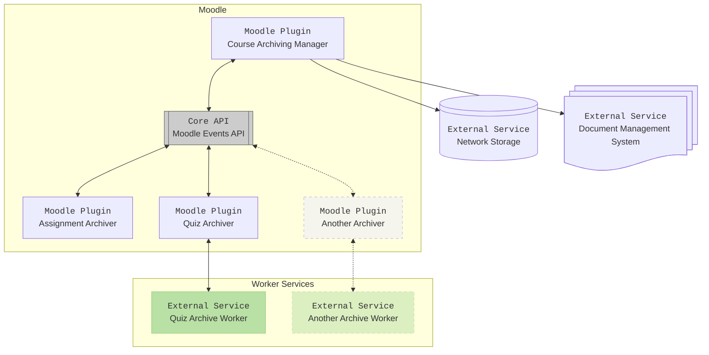

# Architecture

```mermaid
flowchart TB
    subgraph moodle[Moodle]
        %% States
        manager[<tt>Moodle Plugin</tt><br>Course Archiving Manager]
        eventsapi[[<tt>Core API</tt><br>Moodle Events API]]
        assignmentarchiver[<tt>Moodle Plugin</tt><br>Assignment Archiver]
        quizarchiver[<tt>Moodle Plugin</tt><br>Quiz Archiver]
        anotherarchiver[<tt>Moodle Plugin</tt><br>Another Archiver]
        
        %% Connections
        manager <--> eventsapi
        eventsapi <--> quizarchiver
        eventsapi <--> assignmentarchiver
        eventsapi <-.-> anotherarchiver
        
        %% Styles
        style eventsapi fill:#cccccc,stroke:#666666
        style anotherarchiver stroke-dasharray:5 5, opacity:0.5
    end
    
    subgraph workers[Worker Services]
        %% States
        quizarchiveworker[<tt>External Service</tt><br>Quiz Archive Worker]
        anotherworker[<tt>External Service</tt><br>Another Archive Worker]

        %% Connections
        quizarchiver <--> quizarchiveworker
        anotherarchiver <-.-> anotherworker

        %% Styles
        style anotherworker fill:#b9e0a5,stroke:#97d077,stroke-dasharray:5 5, opacity:0.5
        style quizarchiveworker fill:#b9e0a5,stroke:#97d077
    end

    netstorage@{shape: lin-cyl, label: "<tt>External Service</tt><br>Network Storage"}
    dms@{shape: docs, label: "<tt>External Service</tt><br>Document Management System"}
    manager --> netstorage
    manager --> dms
    
```