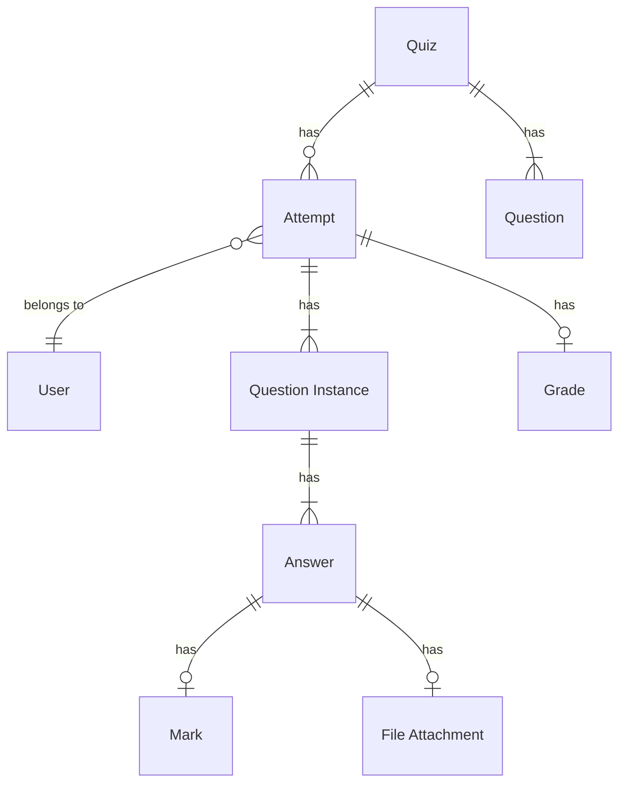

# Data Analysis

This section describes different types of archivable data that can be present inside a Moodle course, primarily within
the context of a Moodle activity. Identified types of data are briefly described, along with their structure and size.

## Activity: Assignment

TODO

!!! info "Official Documentation"
    For more information on the Assignment activity see
    [Moodle Docs: Assignment activity](https://docs.moodle.org/en/Assignment_activity)

## Activity: Choice

TODO

!!! info "Official Documentation"
    For more information on the Choice activity see
    [Moodle Docs: Choice activity](https://docs.moodle.org/en/Choice_activity)

## Activity: Quiz

The Quiz is a very powerful activity that can meet many teaching needs, from simple, multiple-choice knowledge tests to
complex, self-assessment tasks with detailed feedback. It is one of the two most frequently used Moodle activities for
assessing students, the other being the [Assignment activity](#activity-assignment).

Each Quiz consists of a set of questions. These questions can be of different types, such as multiple-choice, true/false,
short answer, essay, and more. Students can take the quiz and submit their answers. Every time a student attempts a quiz,
a new quiz attempt is created. The Quiz activity can be configured to allow multiple attempts, with each attempt being
graded automatically or manually by the teacher. The Quiz activity can also be configured to provide feedback to the
student after each attempt, and to show the correct answers after the quiz is closed.

!!! info "Official Documentation"
    For more information on the Quiz activity see
    [Moodle Docs: Quiz activity](https://docs.moodle.org/en/Quiz_activity)

### Data Structure

- Quiz
    - Quiz metadata (title, description, ...)
    - Questions
    - Attempts
        - Attempt metadata (user, start time, end time, ...)
        - Attempt status
        - User metadata (id, name, email, matriculation number, ...)
        - Questions (question text, answer options, ...)
        - Question answer file attachments [^2]
        - Answers
        - Response history
        - Feedback
            - General question feedback
            - Individual question feedback
            - Overall attempt feedback
        - Question marks
        - Manual question mark overrides and teacher comments
        - Attempt grade (summative)

[^2]: Only applies to essay questions when considering Moodle core question types. Might apply to other third party
question types.

**High-level overview of central data relationships in the Quiz activity**

## Activity: Workshop

TODO

!!! info "Official Documentation"
    For more information on the Workshop activity see
    [Moodle Docs: Workshop activity](https://docs.moodle.org/en/Workshop_activity)

## Course Completion and Grades

TODO

!!! info "Official Documentation"
    For more information on Course completion and Grades in Moodle see
    [Moodle Docs: Course completion](https://docs.moodle.org/en/Course_completion) and
    [Moodle Docs: Grades](https://docs.moodle.org/en/Grade)
